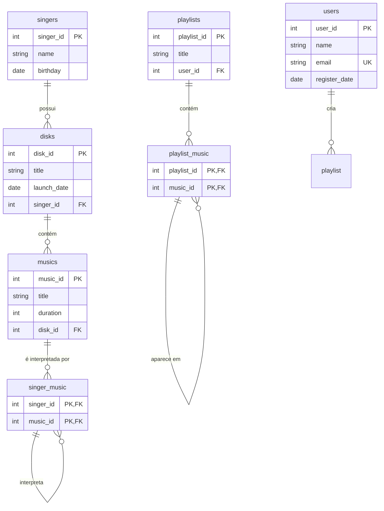

# Projeto de Inserção de Dados em Banco de Dados PostgreSQL com Node.js
Este projeto gera dados aleatórios e os insere em um banco de dados PostgreSQL com uma estrutura relacional. Ele utiliza o Node.js e as bibliotecas `pg` para conexão com o banco de dados e `@faker-js/faker` para gerar dados fictícios.

## Integrante
Sérgio Martins de Oliveira Santos RA: 22.222.021-2

## Modelo Entidade Relacionamento



# Como rodar na sua maquína

## Pré-requisitos

- **Node.js** e **NPM**: Você pode baixar [aqui](https://nodejs.org/).
- **PostgreSQL**: Certifique-se de que o PostgreSQL está instalado e configurado no seu sistema.
- **Configuração do Banco de Dados**: Crie um banco de dados PostgreSQL para receber os dados gerados pelo projeto.

## Instalação

1. Clone este repositório:

   ```bash
   git clone https://github.com/sergiomos/fei-projeto-db1.git
   ```
2. Instale as dependêndicas 

```bash
npm install
```

3. Crie o arquivo .env na raiz do projeto para configurar suas variáveis de ambiente.

```
DB_USER=seu_usuario
DB_HOST=localhost
DB_NAME=nome_do_banco
DB_PASSWORD=sua_senha
DB_PORT=5432
```

4. Rode o projeto

```bash
node insertRandomData.js
```

## Dependências
- pg: Biblioteca para conexão com o PostgreSQL.
- @faker-js/faker: Biblioteca para gerar dados fictícios.
- dotenv: Biblioteca para carregar variáveis de ambiente a partir de um arquivo .env.


